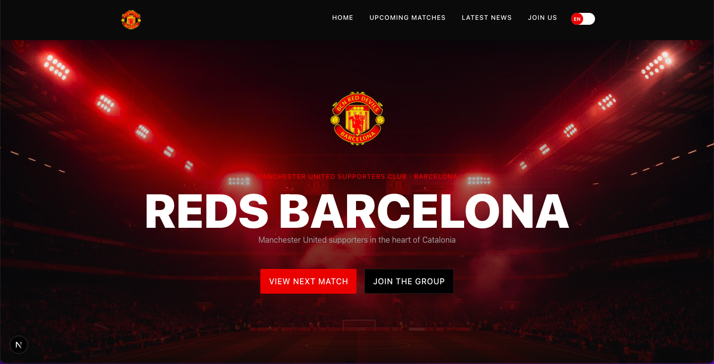

# Red Devils BCN

[](https://nextjs.org)
[](https://reactjs.org)
[](https://www.typescriptlang.org)
[](https://tailwindcss.com)
[](https://www.framer.com/motion/)

Live site: https://barcelonareddevils.com/

Repo / Author: Graeme Byrne — https://github.com/grmbyrn

[](./public/images/bcn-red-devils-screenshot.png)

---

## Project overview and purpose

Red Devils BCN is a small, focused site for the Manchester United supporters club in Barcelona. It aggregates scheduled matches and recent news (The Guardian) and presents them in a responsive, accessible UI. The project demonstrates pragmatic engineering choices for a fast static-like experience using Next.js' App Router, server-side API routes, and lightweight client-side state for UI interactions (i18n, mobile drawer, animations).

## Tech stack (and why)

- Next.js (v16, App Router)
  - Provides a solid foundation for mixing server and client components, built-in routing, and edge-friendly API routes. Chosen for fast dev DX and incremental static/regeneration features.
- React 19 + TypeScript
  - Type safety and modern React features; this project uses client components selectively where interactivity is required.
- Tailwind CSS
  - Utility-first styling keeps styles co-located with markup and enables rapid iteration without heavy CSS files.
- Framer Motion
  - For smooth, accessible micro-interactions (language toggle, subtle hero/image animations) with an ergonomic API.
- lucide-react
  - Lightweight SVG icon set used for UI icons (menu, close, small UI icons).

These choices prioritize predictable performance, small bundle sizes, and developer productivity.

## Key features

- Multi-language support (English / Spanish) with a persistent preference stored in `localStorage`.
- Animated, accessible language toggle (Framer Motion) integrated into the nav.
- Mobile-first responsive layout with an improved mobile drawer (backdrop blur, rounded panel).
- Aggregated news from The Guardian and scheduled matches from the Football-Data API via server API routes.
- Robust fetch helper (`lib/fetcher.ts`) with retries, timeouts and consistent error handling.
- Simple, server-side caching strategy using Next's `revalidate` for API routes.

## Architecture decisions worth noting

- App Router + Server API routes: The app uses Next.js App Router and implements `app/api/*` endpoints to proxy external APIs. This keeps API keys off the client and allows server-side caching with `next` revalidation directives.
- Minimal client-side state: UI state (menu open, language) lives in client components; most data remains server-fetched to maximize cacheability and SEO.
- I18n approach: A small custom provider (`app/lib/i18n.tsx`) exposes translations and a `setLang` function. To avoid hydration mismatches, the provider initializes to a deterministic value server-side and reads `localStorage` / `navigator.language` only after client mount.
- Animations & accessibility: Interactions (language toggle, menu) are keyboard-accessible and animated with Framer Motion; the toggle is a dedicated component (`app/components/LanguageToggle.tsx`) to keep nav markup concise and testable.
- API shaping: API routes transform upstream payloads into compact, UI-friendly shapes (e.g., `app/api/matches/route.ts` maps football-data responses and batches team crest requests to reduce duplicate requests).

## API integrations

- Football-Data.org
  - Used to fetch upcoming matches and team metadata. Calls are proxied through `app/api/matches/route.ts` (server-only). The server route includes caching via `next: { revalidate }` and fetches team crests once per unique team to avoid redundant requests.
- The Guardian Content API
  - The news feed (`app/api/news/route.ts`) queries The Guardian for recent Manchester United articles and returns a small list of article objects (title, thumbnail, URL, publishedAt).

Both integrations require API keys which are loaded from environment variables and never exposed to the client.

## How to run locally

1. Install dependencies:

```bash
npm install
```

2. Create a `.env.local` file in the project root with the required keys (see next section).

3. Start the dev server:

```bash
npm run dev
```

4. Open http://localhost:3000

## Environment variables

The app requires the following environment variables (place in `.env.local`):

- `FOOTBALL_DATA_API_KEY` — API key for Football-Data.org (used by `app/api/matches/route.ts`).
- `GUARDIAN_API_KEY` — API key for The Guardian Content API (used by `app/api/news/route.ts`).

Example `.env.local`:

```
FOOTBALL_DATA_API_KEY=your_football_data_key
GUARDIAN_API_KEY=your_guardian_key
```

> Note: This repo contains placeholders for these keys during development; never commit real keys to a public repo.

## Future roadmap

- Add full i18n support (date/time formatting, pluralization) and expand translation coverage beyond the current strings.
- Persist user preferences server-side (user profiles) and support locale-preferring routes (e.g., `/es`).
- Add unit and integration tests (Jest/Testing Library) around critical UI and API shapes.
- Add CI (GitHub Actions) with linting, type checks and preview deployments.
- Improve caching and edge delivery (Vercel Edge Functions) for ultra-low-latency API responses.

---

If you'd like, I can also:

- Add a real screenshot and polish the README copy for a public README.md.
- Create a GitHub Actions workflow to run lint/type checks and deploy previews.

---

Built by Graeme Byrne — https://github.com/grmbyrn
This is a [Next.js](https://nextjs.org) project bootstrapped with [`create-next-app`](https://nextjs.org/docs/app/api-reference/cli/create-next-app).

## Getting Started

First, run the development server:

```bash
npm run dev
# or
yarn dev
# or
pnpm dev
# or
bun dev
```

Open [http://localhost:3000](http://localhost:3000) with your browser to see the result.

You can start editing the page by modifying `app/page.tsx`. The page auto-updates as you edit the file.

This project uses [`next/font`](https://nextjs.org/docs/app/building-your-application/optimizing/fonts) to automatically optimize and load [Geist](https://vercel.com/font), a new font family for Vercel.

## Learn More

To learn more about Next.js, take a look at the following resources:

- [Next.js Documentation](https://nextjs.org/docs) - learn about Next.js features and API.
- [Learn Next.js](https://nextjs.org/learn) - an interactive Next.js tutorial.

You can check out [the Next.js GitHub repository](https://github.com/vercel/next.js) - your feedback and contributions are welcome!

## Deploy on Vercel

The easiest way to deploy your Next.js app is to use the [Vercel Platform](https://vercel.com/new?utm_medium=default-template&filter=next.js&utm_source=create-next-app&utm_campaign=create-next-app-readme) from the creators of Next.js.

Check out our [Next.js deployment documentation](https://nextjs.org/docs/app/building-your-application/deploying) for more details.
